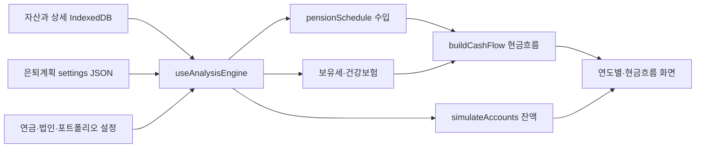

# 01. 현행 분석과 근거

기준 커밋: `053f83ec698d74fa37ba2280b00ee8a4ba388a1c`. 아래 경로는 저장소 루트 기준이다. 정적 검토와 실행 검증을 구분한다. 이번에는 정적 검토만 수행했다.

핵심 코드 바로가기: [분석 훅](../../frontend/src/hooks/useAnalysisEngine.ts), [연금 계산](../../frontend/src/lib/pensionSim.ts), [보유세](../../frontend/src/lib/holdingTax.ts), [건강보험](../../frontend/src/lib/healthInsurance.ts), [현금흐름](../../frontend/src/lib/retirementCashflow.ts), [계좌 잔액](../../frontend/src/lib/accountSim.ts), [은퇴준비 저장](../../frontend/src/pages/RetirementPrepPage.tsx).

## 1. 현재 구조와 유지할 부분

실제 앱은 React 18·TypeScript·Vite 기반 모바일 PWA이며, Dexie로 IndexedDB에 저장한다. `README.md`에는 서버·FastAPI·SQLite 설명이 남아 있지만 현재 구현과 `CLAUDE.md`는 모바일 앱 구조다. 기존 `docs/1~6단계`도 이번 재설계의 최신 계약으로 간주하지 않는다.

`useAnalysisEngine` 공유는 좋은 출발이다. 자산 CRUD, 데이터 이력, 자산별 상세 창, 4개 하단 탭, 연금 원천 자동 연결, 목돈 ID 기반 분배, 백업/복원, 기존 순수 함수 테스트도 유지할 가치가 있다. 문제는 공유 훅 내부에서 수입·잔액·세금이 서로 독립된 가정으로 계산된다는 점이다.

## 2. 우선 해결할 계산·데이터 문제

P0는 은퇴 가능 여부 또는 입력 보존에 직접 영향을 주는 문제, P1은 시간·분류·설명의 정확성을 위한 문제다. 아래 행은 실제 사용자 데이터에서 발생했다고 단정하는 보고가 아니라, 해당 조건에서 발생하는 코드 경로의 검토 결과다.

| ID / 우선순위 | 확인된 코드와 조건 | 사용자 영향 / 필요한 변경 |
|---|---|---|
| F01 / P0 | `pensionSim.ts:350`의 `registeredSources`는 `national`을 제외하지 않음. 월수령액을 `allow.taxable`에 넣고 `:398`에서 국민연금을 다시 합산. `useAnalysisEngine.ts:101`에서 국민연금에도 월수령액을 주입 | 등록 월수령액이 있는 국민연금이 개인연금과 국민연금에 중복 집계될 수 있음. 연금 원천을 상호 배타적 지급 경로로 분리 |
| F02 / P0 | `RetirementPrepPage.tsx:194`는 계획 객체 재구성 시 `holdingTaxAuto`, `holdingTaxAnnual`, `holdingTaxStartYear`를 누락. `:226`은 전체 plan 저장. `db.ts:625`는 전체 JSON 교체 | 생활비만 수정·저장해도 기존 수동 보유세 설정이 사라질 수 있음. 공통 정규화 + 필드 단위 저장 + 버전 충돌 검사 |
| F03 / P0 | `accountSim.ts`는 지급 목표를 원금인출로 만든 뒤 부족 잔액을 0으로 제한하지만 `irpPension`은 목표액 유지 | 원금이 0이어도 지급액이 표시됨. 수입 스케줄과 잔액 원장을 연결하고 미지급액을 별도 반환 |
| F04 / P0 | `useAnalysisEngine.ts:89`는 모든 미처분 PENSION 현재가치를 IRP 원금에 합산. 현금흐름은 다른 `pensionSchedule` 사용 | 국민연금·비과세연금까지 IRP 잔액으로 들어갈 수 있고 수입과 자산 감소 불일치. 계좌와 연금 지급권 구분 |
| F05 / P0 | `holdingTax.ts:107`은 부부 공시가격을 합쳐 공제 1회 후 세액을 나눔. `isOwned`로 1주택 공제를 판단 | 인별 과세 원칙과 공동명의 특례를 표현하지 못함. 주택 수·소유자·특례 선택을 규칙 입력으로 분리. 국세청 근거 S1 |
| F06 / P0 | `healthInsurance.ts:100`은 처분일이 있으면 전 기간 제외. `holdingTax.ts`는 처분 연도까지 포함. `accountSim.ts` 부동산 입력에는 처분일 자체가 없음 | 같은 부동산이 건강보험에는 없고 보유세에는 있으며, 매각 이후에도 자산 잔액에는 남을 수 있음. 공통 날짜별 상태 해석 필요 |
| F07 / P0 | `pensionSim.ts:336`, `useAnalysisEngine.ts:234`는 미래 목돈 분배를 모두 현재 원금에 더한 뒤 성장. `PensionAllocation`에는 수령일이 없고 해당 계산은 원천 목돈 수령연도를 조회하지 않음 | 아직 받지 않은 퇴직금으로 수익이 발생할 수 있음. `lumpsumId`로 날짜를 찾아 실제 유입 시점에 입금 |
| F08 / P0 | `useAnalysisEngine.ts:63`에서 법인 배당에 `netFactor`로 세후 처리 후 `retirementCashflow.ts:115`의 미연동 분기에서 다시 15.4% 차감 | 법인 연동 배당의 중복 세금 경로. 지급총액·원천징수·실수령·정산세액 분리 |
| F09 / P1 | `RealEstateDetail`은 `futureValue/futureYear`만 저장. `holdingTax.ts:valueAt`은 그 연도에 가격만 교체 | 재건축 단계·멸실·토지·사용승인·입주·임대·추가 분담금·취득 관련 현금 유출을 표현할 수 없음 |
| F10 / P1 | `healthInsurance.ts:107`은 시가×0.6, `holdingTax.ts`는 시가×0.75×0.6. `healthInsurance.ts:109`는 받은 임차인 보증금을 임차보증금 입력에 연결 | 동일 자산의 과표가 서로 다르고, 반환 의무인 보증금과 내가 지급한 보증금이 혼재. 평가·과표·채권·부채 구분 |
| F11 / P1 | `pensionSim.ts:658`에서 기존 `principal`이 자산의 변경된 `currentValue`보다 우선 | 입력 자산 평가액을 고쳐도 분석 원금이 과거 값에 남을 수 있음. 원천값과 명시적 시나리오 override 구분 |
| F12 / P1 | `pensionSim.ts:422` 이후 연금은 남편에게 전액 배정. 아내에게 연금소득 0으로 건보 산정 | `owner='wife'` 입력을 분석이 따르지 못함. Person ID별 지급·소득 분류 필요 |
| F13 / P1 | `pensionCalc.ts:4`의 시작연도 2029 고정. `retirementCashflow.ts:67`의 시작 현금 0. 생활비는 기간 전체 고정 | 2027년 은퇴·현재 예금·물가 상승·은퇴 전 저축을 현실적으로 연결하지 못함 |
| F14 / P1 | `retirementCashflow.ts:123` 월 지출·여유에는 연간 세금과 일회성 지출이 빠짐. 이후 누적에서 차감 | 월 여유가 양수라도 연간 현금은 감소 가능. 세후 반복 수지와 일회성 흐름, 실제 기말 현금을 분리 표시 |
| F15 / P1 | `pensionSim.ts:382` 배당 성장 경과연수를 `year-fromYear`로 계산 | 동일 2035년의 결과가 조회 범위 시작연도에 따라 달라짐. 조회 구간은 결과 필터여야 하며 성장 기준일을 바꾸면 안 됨 |
| F16 / P1 | `healthInsurance.ts:55` 7.09%, `:56` 장기요양 12.95%, `:74` 차량 부과 경로. 부부를 각각 지역가입자로 계산 | 규칙 귀속연도와 보험 가입 단위·피부양자·직장가입 전환 모델 필요. 2026 건강보험료율은 7.19%로 발표됨(S2). 차량분은 폐지 정책과 대조 필요(S3) |
| F17 / P1 | `useAnalysisEngine.ts`의 법인 현금흐름에는 `annualMaintCost`가 빠지지만 `corpSim.ts:185`의 계산에는 존재 | 법인 비교 화면과 은퇴 현금흐름의 비용 범위가 다름. 같은 엔진 결과를 사용 |
| F18 / P1 | `useAnalysisEngine.ts:23` 등 여러 비동기 조회를 기본 빈값으로 계산하고 준비 완료 상태를 합치지 않음 | 로딩·조회 실패가 자산 없음/수입 0으로 보일 위험. 필수 데이터 준비 후 실행하고 오류 상태 분리 |

### 세금 계산에서 별도 검증할 항목

`holdingTax.ts`의 지분별로 먼저 과표를 나누고 누진세율을 적용하는 방식, 종부세에서 재산세 본세 전체를 공제하는 방식, 재산세와 종부세를 합쳐 지방교육세로 표시하는 방식, 다주택 관련 주석은 공인 정답으로 재사용하면 안 된다. 주택별 산출 후 지분 배분 규칙, 공제 대상 재산세액, 지방교육세와 농어촌특별세를 각각 검토해야 한다. 이 검토에서 세율표 전체를 대체 확정하지는 않았다.

`severanceTax`도 근속연수 없이 금액만 받는 단순식이다. 퇴직금의 전액 기준 과세·과세이연·부분 현금화 관계를 명시하지 않고 현금 배정 잔여액에 독립 적용하면 과세 구조가 달라질 수 있다. 소득세·연금세·건보는 최신 검증된 규칙 또는 사용자가 확인한 예상 납부액으로 계산 범위를 명확히 해야 한다.

## 3. 합성 입력으로 보는 재현 절차

다음은 코드 식을 따라 도출한 예상 동작이다. 실제 테스트 실행 결과가 아니다.

| 사례 | 입력 / 조작 | 기준 코드에서 예상되는 동작 | 새 설계의 검증 기준 |
|---|---|---|---|
| 국민연금 중복 | 월 100만 원 국민연금을 sources와 nationals에 연결, 시작 2030년 | 국민연금 연 1,200만 원 + 개인연금 연 1,200만 원으로 집계 | 동일 지급권의 연 유입 총액은 1,200만 원 |
| 잔액 소진 | 초기 IRP 100원, 월 지급 목표 10원, 수익률 0%, 2년 | 첫해 120원 지급 표시 후 잔액 0; 다음해에도 120원 지급 표시 | 실제 지급 ≤ 사용 가능한 잔액, 미지급 목표는 부족액으로 별도 표시 |
| 처분일 충돌 | 시가 10억, 미래 가치 15억/2030년, 처분일 2035-05-31 | 2030년 건보 재산분에서 제외, 보유세에는 포함; 2036년 잔액에도 15억 유지 | 2035-05-31 기준 상태 종료, 과세기준일 별도 판정, 매각대금·상환·세금 원장 연결 |
| 보유세 설정 유실 | 수동 보유세 120만 원/2030년 저장 → 은퇴준비에서 생활비 수정·저장 | 보유세 필드가 저장 JSON에서 사라지고 재정규화 시 자동 계산으로 바뀔 수 있음 | 다른 섹션 저장으로 해당 필드가 바뀌지 않음 |
| 월 여유 오해 | 2029년 월 연금 100만, 월 생활비 100만, 연 보유세 120만, 다른 흐름 0 | 월 여유 0원, 해당 연 누적 -120만 원 | 세후 반복 수지 월평균 -10만 원과 실제 납부월 표시 |
| 법인 배당 중복 과세 | 세전 월 배당 100만, 원천세 15.4%를 이미 차감해 84.6만 전달 | 그 금액에 다시 연 1,563,408원 소득세 차감 | 원천징수는 한 번만 현금 반영; 추가 정산액만 별도 처리 |
| 자산 변경 미반영 | 기존 원금 1억, 원천 자산 평가액 2억으로 수정, 연결계좌 없음 | 기존 principal 1억 유지 | 수동 override가 없으면 새 스냅샷에서 2억 사용 |

## 4. 화면 사용성 문제

- 분석은 ‘연도별·은퇴준비·연금시뮬·법인시뮬·현금흐름’ 5개 탭이다. 사용자는 “언제 은퇴할 수 있나” 대신 어느 계산기에 들어가 연동해야 하는지 알아야 한다. `AnalysisPage.tsx:10`.
- 연도별 화면에는 이미 상세 목록이 있지만 항상 길게 나열되고, KPI는 클릭해 원천까지 들어가는 구조가 아니다. 연도 이동은 +/-에 의존한다. `YearDashboardPage.tsx`.
- `Line`은 0원 이하를 숨긴다. 미입력·해당 없음·지급 전·계산 실패를 구분하지 못한다.
- 분석 탭은 최초 URL을 local state에 넣고 이후 선택은 localStorage만 갱신한다. URL과 선택 상태가 동기화되지 않아 뒤로가기·직접 링크와 충돌할 수 있다. `AnalysisPage.tsx:29`.
- 은퇴준비와 현금흐름이 동일 계획을 각각 편집하고 전체 저장한다. 변경 후 탭 이동 시 저장 여부가 분석 결과와 연결되지 않는다.
- `AssetModal.tsx`는 ESC 처리와 모바일 전체 화면을 갖췄지만 dialog 역할, 초점 가두기·복귀, 닫기 버튼 접근성 이름을 이 컴포넌트에서 제공하지 않는다. 접근성 동작은 실행 확인이 필요하다.
- 첫 실행 시 샘플 자산을 실제 DB에 자동 삽입한다. 샘플용 별도 공간과 실제 계획 시작을 분리해야 잘못된 은퇴 결과를 피할 수 있다. `App.tsx:Bootstrap`.

## 5. 데이터 안전성

`db.ts:767`의 복원은 app 식별자만 검사하고 모든 테이블을 트랜잭션에서 교체한다. 트랜잭션 사용은 유지한다. 다만 파일 버전·필수 테이블·참조 ID·금액·날짜를 먼저 검사하지 않아, 일부 테이블이 없는 파일이 정상 복원처럼 처리될 수 있다. 백업 생성도 여러 테이블을 하나의 읽기 트랜잭션으로 묶어 일관된 시점의 복사본을 보장할 필요가 있다.

`App.tsx:Bootstrap`은 마이그레이션 예외를 무시한다. 재설계에서는 실패를 사용자에게 알리고 이전 데이터로 돌아갈 수 있어야 한다. PWA 업데이트와 DB 이전의 호환성도 배포 기준에 포함한다.

## 6. 공식 자료와 해석 범위

- S1. [국세청 종합부동산세 안내](https://www.nts.go.kr/nts/cm/cntnts/cntntsView.do?cntntsId=7733&mi=2352): 6월 1일, 인별 합산, 주택과 토지 구분. 이 원칙을 F05·F06·재건축 모델의 근거로 사용. 특정 소유 구조의 최종 세액을 판정한 것은 아님.
- S2. [보건복지부 2026년 건강보험료율 결정](https://www.mohw.go.kr/gallery.es?act=view&bid=0003&list_no=379625&mid=a10607030000): 2025-08-28 발표, 2026년 7.19%. 현재 코드 7.09%와 적용연도 불일치 확인.
- S3. [복지로 2024 복지서비스 안내](https://www.bokjiro.go.kr/ssis-tbu/cms/pc/common/download/2024%EB%85%84%20%EC%95%88%EB%82%B4%EC%B1%85%EC%9E%90%20%5B%EC%9E%A5%EC%95%A0%EC%9D%B8%5D.pdf): 2024년 2월 자동차 건보 부과 폐지 안내. 차량 계산 경로 재검증 근거.
- S4. [국가법령정보센터 취득세 판례](https://www.law.go.kr/LSW/precInfoP.do?precSeq=202969): 사용승인 등 취득시기의 중요성을 확인하는 역사적 사례. 현행 재건축 취득세의 포괄적 규칙으로 사용하지 않음.

열람일은 2026-09-14. 향후 구현 시 해당 귀속연도의 법령·공단 계산 기준·특례를 다시 확인하고 규칙 버전으로 고정한다.
