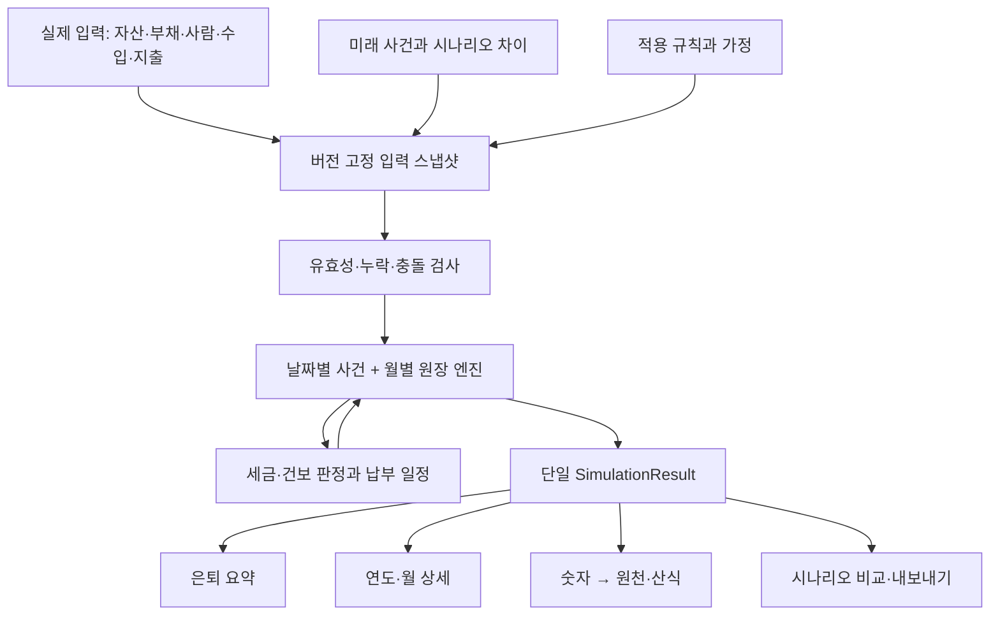
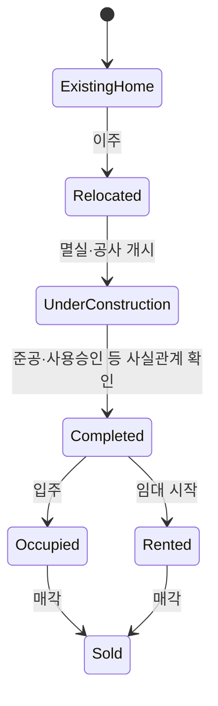

# 02. 데이터와 계산 엔진 재설계

개정 2: 현재 관측·실적과 미래 스냅샷의 경계는 [07의 6절](07-current-assets-and-retirement.md)을 함께 적용한다. 아래 엔진 계약은 미래 전망용이며, 현재 자산 조회를 은퇴계획 검증이나 SimulationResult에 종속시키지 않는다.

## 1. 제품이 답해야 할 질문

“현재 계획대로 은퇴하면 필요한 생활비를 충당할 수 있는가?”, “언제 현금이 부족해지는가?”, “어떤 자산·사건·가정 때문에 그런가?”, “준공 지연·은퇴 연기·지출 조정 중 무엇이 얼마나 도움이 되는가?”를 같은 데이터로 설명한다.

성공 여부는 총자산 증가만으로 판단하지 않는다. 부동산 가치가 높아도 현금이 부족할 수 있고, 주식 인출로 생활이 가능해도 원금이 빨리 소진될 수 있다. 명목금액·현재 구매력, 순자산·유동자산, 소득·원금 인출을 구분한다.

한국 거주 개인·가구, 원화 기준, 기존 로컬 PWA를 1차 범위로 한다. 세금은 버전이 있는 추정 모듈로 구현하고, 미지원 거래는 확인된 수동 예상액과 적용 범위를 받을 수 있게 한다. 다국가 세무·자동 금융기관 연동·법인 최적화·확률적 성공률은 기본 계산이 검증된 이후 확장한다.

## 2. 계산의 공통 계약



엔진은 React 훅이나 DB에 의존하지 않는 순수 함수로 둔다. `useAnalysisEngine`은 필요한 데이터를 준비하고 엔진을 실행하는 어댑터로 줄인다. 조회 범위·차트 모양은 계산 결과를 바꾸지 않는다.

```ts
type SimulationInput = {
  snapshotId: string;
  dataRevision: number;
  asOfDate: string;             // YYYY-MM-DD, Asia/Seoul의 달력 날짜
  scenarioId: string;
  horizonEnd: string;
  ruleSetIds: string[];
  assumptionSetId: string;
  engineVersion: string;
  household: Household;
  positions: Position[];
  liabilities: Liability[];
  incomeStreams: IncomeStream[];
  expenseRules: ExpenseRule[];
  events: PlanEvent[];
};
type SimulationResult = {
  runId: string;
  inputHash: string;
  status: 'complete' | 'partial' | 'invalid';
  months: MonthResult[];
  years: YearResult[];
  metricIndex: Record<string, MetricNode>;
  issues: CalculationIssue[];
  eventEffects: EventEffect[];
};
```

위 타입은 계약 초안이다. 참조 타입의 의미는 아래 표로 정한다. 실행 가능한 완성 스키마는 첫 구현 단계에서 Zod와 TypeScript로 함께 정의한다.

## 3. 데이터 모델

| 개체 | 필수 의미·주요 필드 | 기존 데이터와 관계 |
|---|---|---|
| Household / Person | 가구 ID, 사람 ID, 표시 이름, 생년월, 개인별 은퇴일, 계획 종료 조건 | husband/wife 고정 키를 사람 ID로 이전. 1인 가구는 실제 1명만 계산 |
| Account | 소유자, 종류(현금·과세투자·IRP·연금저축), 통화, 인출 제한, 외부 식별자 | 계좌명을 ID처럼 쓰지 않음. 이름 변경과 연결 관계 분리 |
| Position | 경제적으로 한 번만 셀 자산, 계좌 ID, 분류, 수량·가격·평가기준일, 유동화 조건 | STOCK과 PENSION이 같은 계좌를 표현하면 중복 평가 제거 |
| Valuation | 자산 ID, 목적(market/official/assessed), 금액, 유효일, 출처, 확정/추정 | currentValue와 공시가격·세금 과표를 분리. 미래 시가는 시나리오 가정 |
| Property | 부동산 ID, 건물/토지/권리 구분, 상태 이력, 거주 용도, 면적 등 규칙별 필요정보 | RealEstateDetail 확장. 실제 보유 여부와 실거주 여부 분리 |
| OwnershipPeriod | 대상 ID, 사람 ID, 지분, 시작·종료일 | 현재 지분 하나가 아니라 과세기준일의 지분 조회 |
| Liability | 종류, 채권자, 잔액, 금리와 변경 일정, 원리금 방식, 만기, 연결 자산 | loanAmount·받은 tenantDeposit을 독립 부채로 이전 |
| LeaseContract | 임대인/임차인 역할, 보증금, 월세, 시작·종료일, 수령/반환 일정, 공실 가정 | 내가 받은 보증금은 부채, 내가 낸 보증금은 회수 가능한 자산 |
| PensionEntitlement | 개인 ID, 연금 종류, 시작일, 종료 조건, 지급액·인상 가정, 과세 자료 | 국민연금 등 지급권은 IRP 인출 가능 원금이 아님 |
| IncomeStream | 소유자, 출처 ID, 세전/세후 입력 구분, 금액, 지급 주기, 시작·종료일, 과세 분류 | 급여·공적연금·임대·배당을 명확히 분류 |
| ExpenseRule | 목적, 기준 월금액, 시작·종료 조건, 물가율, 필수/선택, 자금 계좌 | 은퇴 전후·고령기 의료비·여행 감소를 별도 구간으로 표현 |
| PlanEvent | 대상, 사건 종류, 예정일/확정일, 선행 사건, 지연 규칙, 상태, 현금 효과 | futureYear, lumpsum, emergency를 ID 연결 사건으로 변환 |
| Scenario | 기본 스냅샷 ID, 이름, overrides, 사건 이동, 가정 집합 | 원천 사실을 덮어쓰지 않고 차이만 보관 |
| InsuranceMembership | 사람·세대 ID, 지역/직장/피부양자 등 자격, 시작·종료일, 보험료 반영 기준 | 모든 사람에게 독립 지역가입자 보험료를 부과하지 않음 |
| RuleSet | 세목/보험 규칙, 공표일, 시행일, 귀속기간, 출처, 검증 상태, 지원 범위 | 소스 코드의 날짜 없는 상수 분산을 대체 |

원화 보고금액은 원 단위 정수로 저장하되, 원통화 원자료는 `Money(amountDecimal, currency)`로 보존한다. 원통화 단가·외화 배당·부분주 수량·환율은 각 정밀도가 명시된 고정소수점으로 저장하며 KRW 정수로 변환해 원자료를 잃지 않는다. 계산 중 소수와 비율은 명시된 Decimal 또는 충분한 정밀도의 정수 스케일을 사용한다. 반올림은 규칙 단계와 화면 단계에 명시하고, 상세 합계와 총계의 반올림 차이는 ‘반올림 조정’으로 설명한다. 통화 변환은 환율과 기준일을 기록한다. 연 단위 데이터만 있으면 날짜 정밀도를 `year`로 보존하고 실제 일자를 만들어 확정된 사실처럼 표시하지 않는다.

## 4. 재건축의 상태와 사건

자산 상태와 현금 사건을 분리한다. 같은 주택의 생애를 여러 독립 자산으로 중복 등록하지 않는다. 권리에서 완공 주택으로 전환하는 경우에는 경제적 연속성 ID와 법적 대상 ID의 관계를 남긴다.



이 상태도는 UX용 일반 모형이다. 법률상 권리 전환·취득 시기·주택 수 판정은 별도 사실과 세목별 규칙으로 판단한다. 분양권·입주권을 모든 세목에서 같은 주택 수로 세면 안 된다.

### 예시 일정: 현재 공사 중인 A주택

아래 금액과 날짜는 설계 검증용 가상 사례다.

| 사건 | 기본 일정 | 입력·연결 | 변화가 전파되는 곳 |
|---|---|---|---|
| 현재 상태 | 2026-09-14 공사 중 | 권리 시가, 토지 과세자료, 이주비 대출, 임시 주거비 | 현재 자산·부채, 준공 전 현금·세금 |
| 추가 분담금 | 2029-12 3,000만 원 | 지급일 고정 계약 사건, 출금 계좌 | 해당 월 현금, 취득원가 추적 |
| 사용승인 예상 | 2030-09-30 | 확정 여부, 별도 실제 사용일 | 상태·세금 판정의 입력 |
| 잔여 분담금 | 준공 시 2,000만 원 | 준공 연동 사건 | 준공 이동 시 지급월 이동 |
| 임대 시작 | 사용승인 후 1개월 | 월 150만 원, 임차인 보증금, 최초 일할 정책 | 반복 소득·보증금 부채·세금 |
| 이주비 대출 정산 | 준공 시 | 대출 잔액·이자·정산일 | 현금·부채 감소 |
| 가치 재평가 | 완공 상태 전환 시 | 완공 후 예상 시가, 공시가격은 별도 | 자산 평가. 현금 수입에는 미포함 |
| 장래 매각 | 사용자 선택 | 대금·날짜·비용·부채 정산·세금 예상 | 자산 종료와 매각 순유입 |

지연안은 준공일을 12개월 이동한다. 임대 시작과 잔여 분담금처럼 `anchorEventId`에 연결된 일정만 자동 이동한다. 계약상 고정된 2029년 분담금은 유지한다. ‘일정 이동으로 바뀌는 항목’을 저장 전 보여주고, 선후관계 위반·입주 전 임대·매각 후 임대는 오류 또는 명시적 예외로 처리한다.

### 과세 발생과 납부 시점

- 준공 전: 토지·권리·기존 주택의 실제 상태에 맞는 검증된 규칙을 사용한다. 미확인인 경우 ‘세금 0원’으로 채우지 않는다.
- 보유세: 해당 연도 6월 1일의 소유·과세대상 상태를 스냅샷으로 판정한다. 이후 납부 일정에 현금 유출을 배치한다. [국세청 기준](https://www.nts.go.kr/nts/cm/cntnts/cntntsView.do?cntntsId=7733&mi=2352)
- 취득 관련 세금: 계획상 준공 연도 하나가 아니라 실제 취득 사유와 날짜 판단 자료를 받는다. 지원하지 않는 재건축 조합원 사례는 사용자가 확인한 예상액·납부일을 연결한다.
- 임대 과세: 임대 수입의 시작일과 귀속기간으로 계산하며 원천징수·정산 납부 시점을 분리한다.
- 건강보험: 소득 발생연도와 보험료 반영기간을 같은 것으로 가정하지 않는다. 자격 변경과 반영 시차를 규칙 또는 확인된 일정으로 다룬다.
- 장기 전망: 확정된 규칙 적용기간과 이후 ‘해당 규칙 유지 가정’을 구분한다. 2030년 세율이 확정됐다고 표현하지 않는다.

예를 들어 예상 사용승인이 2030-09-30이면, 2030-06-01은 승인 전 상태, 2031-06-01은 승인 후 상태를 조회한다. 실제 과세대상 판단은 사용·소유 사실과 규칙 검증 결과에 따른다. ‘완공년=보유세 시작년’으로 자동 치환하지 않는다.

## 5. 월별 원장과 지급 가능성

전체 복식부기 제품을 만들 필요는 없지만 내부 거래는 금액 보존이 가능해야 한다. `LedgerEntry`는 거래 ID·날짜·원천 사건·출발/도착 계좌·분류·세전액·원천세·실수령액·관련 세금 ID를 보관한다.

월 계산 순서는 다음과 같다.

1. 월초 잔액과 사람·자산·보험의 유효 상태를 불러온다.
2. 월 안의 사건을 날짜·우선순위·안정적 ID 순서로 처리한다. 같은 날 소유 이전과 과세 판정은 법규의 기준으로 해결하고 임의의 배열 순서에 맡기지 않는다.
3. 급여·연금·배당·임대 등 외부 유입과 계약상 이전을 기록한다.
4. 필수 지출·부채 상환·분담금·납부 예정 세금을 기록한다.
5. 부족분은 사용자가 설정한 인출 순서와 계좌 제약에 따라 충당한다. 현금 → 허용 투자계좌 → 허용 연금계좌 등으로 구성하며, 자가 매각은 별도 계획 없이는 자동 수행하지 않는다.
6. 인출로 생긴 추가 세금은 같은 월의 결정적 정산 절차로 해결한다. 수렴 한계·오차·최대 반복을 정하고 실패하면 부분 결과와 부족액을 반환한다. 조세 전액을 인출금으로 착각하지 않는다.
7. 지급 가능한 만큼만 거래를 확정하고 부족액은 `unfundedNeed`로 남긴다. 미지급 목표가 수입으로 잡히면 안 된다.
8. 투자 평가손익·배당 재투자 정책을 적용하고 월말 잔액·세금 미지급액·원장 보존식을 검사한다.

수익률의 의미를 명확히 한다. 기본 입력은 ‘가격 상승률’과 ‘배당률’을 분리한다. 총수익률을 입력하는 모드에서는 배당을 추가 수익으로 다시 더하지 않는다. 연 기대 가격상승률의 월 변환은 `(1+r)^(1/12)-1`을 사용하고, 과거 실적을 미래 확정 수익으로 취급하지 않는다.

핵심 보존식:

```text
기말 현금 = 기초 현금 + 외부 현금 유입 - 외부 현금 유출
                         + 다른 자산의 현금화 - 다른 자산 취득
                         + 차입 - 원금 상환
계좌 기말 = 계좌 기초 + 입금 - 출금 + 평가손익 + 계좌에 남긴 수익
순자산 = 인식 대상 자산 합계 - 부채 합계
가구 내부 계좌이체 순현금 변화 = 0
받은 보증금: 현금 증가 = 반환부채 증가
실제 지급액 + 미지급액 = 지급 목표액
```

연금계좌 인출은 계좌 원금 감소와 생활계좌 증가를 동시에 기록한다. 국민연금 지급은 외부 유입이며 IRP 잔액을 줄이지 않는다. 매각은 부동산 제거와 현금 유입, 대출·보증금 정산, 거래비용·세금을 하나의 사건 묶음으로 처리한다. 미수 매각대금은 결제 전에 현금으로 사용하지 않는다.

원천징수액은 지급 시 한 번만 차감한다. 연간 확정 세액에서 이미 낸 세액을 차감한 금액만 정산 납부 또는 환급한다. 원천세·발생세액·납부세액을 서로 더해 지출로 세 번 계산하면 안 된다.

## 6. 결과 지표와 설명 계약

| 지표 | 정의 | 클릭 시 내용 |
|---|---|---|
| 세후 반복 수지 월평균 | 반복 유입(계좌 인출 별도 구분) − 반복 지출 − 대응 세금·보험료의 월평균 | 세전/세후, 원금 사용액, 실제 월별 편차, 포함·제외 항목 |
| 기말 생활자금 | 생활계좌 등 즉시 사용 가능한 현금 잔액 | 기초 잔액부터 거래별 증감; 제한·예약 현금 표시 |
| 최초 자금 부족월 | 인출 정책 적용 후에도 필수 지출을 충당하지 못하는 첫 월 | 부족액·원인·가용 자산·미실행 대안 |
| 최저 유동성 | 전체 기간 중 최소 가용 현금과 발생월 | 준공 정산·납부세금 등 원인 |
| 순자산 / 인출 가능 자산 | 부채 차감 총액 / 시점·계좌 제약에 따라 사용 가능한 금액 | 부동산·연금 지급권과 인출 가능 원금 구분 |
| 목표 충족 상태 | 정의한 필수 지출·최소 현금·종료시점 자산 조건 충족 | 미충족 조건, 계산 누락, 가정 민감도 |

‘안전한 은퇴 나이’는 단일 수치로 단정하지 않는다. 설정된 시나리오에서 부족이 없는 가장 이른 은퇴 시점을 탐색하되 탐색 범위와 성공 조건을 함께 보여준다. 필수 세금이나 자산 데이터가 미확정이면 ‘평가 보류’로 표시한다.

```ts
type MetricNode = {
  id: string;
  period: string;
  unit: 'KRW' | 'KRW/month' | 'ratio' | 'date';
  value: number | null;
  quality: 'verifiedInput' | 'estimated' | 'incomplete' | 'unsupported';
  childIds: string[];
  inputRefs: { entityId: string; field: string; revision: number }[];
  eventIds: string[];
  ruleRefs: string[];
  formulaId: string;
  explanation: string;
};
```

검증된 입력을 사용해도 미래 결과 자체가 확정되는 것은 아니다. UI는 입력 품질과 미래 추정 표시를 별도로 제공한다. 상세 화면은 다시 계산하지 않고 같은 run의 `MetricNode`를 읽는다. 합계에 영향을 주는 미확정 항목은 하단 주석에만 숨기지 않는다.

## 7. 시나리오·물가·불확실성

기본안의 원천 스냅샷을 복제 참조하고 수정점만 저장한다. 권장 비교 시작점은 준공 1년 지연, 은퇴 2년 연기, 생활비 10% 증가, 은퇴 초기 시장 하락이다. 기본값은 가정이며 추천 투자수익률이 아니다.

같은 데이터·규칙·물가 표시·종료일을 가진 결과만 직접 비교한다. 차이 설명은 준공 변경처럼 직접 원인과 세금·공실처럼 파생 효과를 연결한다. 여러 요인이 상호작용하는 경우 단일 요인의 절감액 합계가 전체 차이와 일치한다고 보장하지 말고 상호작용 잔여분을 표시한다.

명목 전망에서 항목별 물가를 먼저 적용하고, 현재 구매력은 고정 기준일의 물가지수로 환산한다. 의료·주거 등 다른 증가 가정은 명시한다. 시나리오가 3개 있다고 ‘성공확률 67%’를 표시하면 안 된다. 확률 분석은 수익률 분포·상관·순서 위험·경로 수·시드가 검증되는 후속 단계다.

## 8. 기술 구조와 저장

```text
src/domain/           사람·자산·계좌·부채·사건·스키마
src/engine/           simulate / events / ledger / funding / projection
src/rules/kr/         세목·보험별 규칙과 적용기간
src/application/      snapshot / scenario / migration / calculation-cache
src/features/         home / assets / plan / analysis / explanation
src/infrastructure/   Dexie 저장소·백업·선택적 외부 연결
```

전체 프레임워크 교체나 서버 도입은 필요하지 않다. IndexedDB 버전 migration을 사용해 새 테이블을 추가하고 기존 기록을 보존한다. 계산 캐시 키는 입력 해시·규칙·엔진 버전이며 결과는 재생성 가능하다. 필요하면 계산을 Web Worker로 이동하되 실측 전부터 복잡도를 늘리지 않는다.

저장은 초안 자동 보관과 유효한 계획 적용을 분리한다. 유효성 검사가 통과한 필드 패치를 단일 트랜잭션으로 저장하고 revision을 증가시킨다. 미저장/저장 중/저장 실패/분석 반영 완료를 보여준다. 다른 탭의 오래된 전체 객체가 최신 계획을 덮어쓸 수 없게 한다.

기본 입력은 기기 내 보관한다. 기존 Google Drive 등의 선택적 백업 연결이 있다면 저장 범위·최근 성공·복원 검증을 분명히 한다. 진단 로그에는 금액·생년월·주소를 기본 수집하지 않는다. 샘플은 별도 데이터 공간으로 제공한다.
